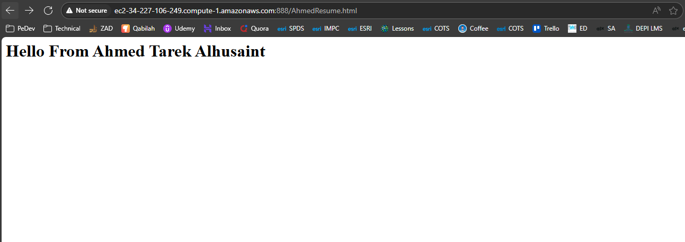

# Nginx Publishing Options (All the Ways)

## A) Single default site (quick & dirty)

* **Where:** `/etc/nginx/sites-available/default` (Debian/Ubuntu) or directly inside `nginx.conf` on RHEL.
* **Use when:** You just need one simple site fast.

```nginx
# inside the existing server { } of the default
root /var/www/html;
index index.html;
```
### Done in Lab 3 Exercise 
---

## B) Debian-style virtual hosts (clean, multi-site)

* **Where:**

  * Put site file in: `/etc/nginx/sites-available/virtualhost1`
  * Enable via symlink to: `/etc/nginx/sites-enabled/virtualhost1`
  * Enable via `sudo systemctl reload nginx
* **Use when:** You want **many** sites, clean separation, easy enable/disable.

```bash
sudo vim /etc/nginx/sites-available/virtualhost1 
ubuntu@ubWebServer01:/etc/nginx$ cat sites-available/virtaulhost1
server {

        listen 888;
        server_name _;
        root /var/www/html;
        index AhmedResume.html;
        #Default Location
        location / {

        try_files $uri $uri/ =404;


        }

  error_page 404 /404.html;   
  location = /404.html {}
}

# Go To Root DOcument Path 
ubuntu@ubWebServer01:/etc/nginx$ cd /var/www/html/
ubuntu@ubWebServer01:/var/www/html$ ls
404.html  AhmedResume.html  BKindex.nginx-debian.html  indexCustomDefaultPage.html

sudo vim /etc/nginx/sites-available/AhmedResume.html 
sudo vim /etc/nginx/sites-available/404.html 

ubuntu@ubWebServer01:/var/www/html$ cat AhmedResume.html
<h1> Hello From Ahmed Tarek Alhusaint </h1>
ubuntu@ubWebServer01:/var/www/html$ cat 404.html
<h1> LOL 404 , LOo0L </h1>
sudo nginx -t && sudo systemctl reload nginx

```


## The Issue Here I couldnt config 404 Custom Page
