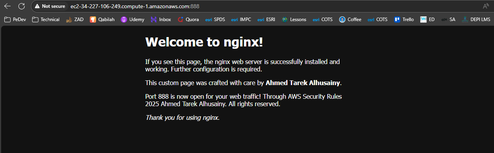

# 🧪 Lab 3: Basic Configuration Modification

## 📝 Task

> Modify the basic Nginx configuration to serve a custom HTML page, verify configuration correctness, view changes in a browser, and change the default listening port.

**Subtasks:**

1. **Task 3.1** – Create a Custom HTML Page
2. **Task 3.2** – Test Configuration Syntax
3. **Task 3.3** – View Your Custom Page
4. **Task 3.4** – Modify Default Port

---

## ✅ Steps

1. Prepare a new HTML file to replace or supplement the default Nginx page.
2. Verify that the Nginx configuration syntax is valid before applying changes.
3. Reload or restart Nginx, then access the page in a browser to confirm changes.
4. Change the default port Nginx listens on and confirm the new port is working.

---

## 💻 Command(s)

```bash
# First I will Take Bk Of Default Document config in site aviable 
cd /etc/nginx/sites-available
sudo cp default BKdefault

# Edit Custom Config 
server {
        listen 888 default_server;
        listen [::]:888 default_server;
        root /var/www/html;
        # Add index.php to the list if you are using PHP
        #index index.html index.htm index.nginx-debian.html;
        indexCustomDefaultPage.html
        server_name _;

        location / {
                # First attempt to serve request as file, then
                # as directory, then fall back to displaying a 404.
                try_files $uri $uri/ =404;
        }

# Start Adding Custom HTML Page & Config
sudo vim default

#Then Bk Root Document File and Add Custom HTML Page
sudo cp /var/www/html/index.html indexCustomDefaultPage.html
sudo cp /var/www/html/index.html Bkindex.html 
sudo vim ndexCustomDefaultPage.html #Then Add my custom page

#Then Test My Config 

nginx -t 

root@ubWebServer01:/var/www/html# nginx -t
2025/08/14 20:53:58 [emerg] 70020#70020: unknown directive "indexCustomDefaultPage.html" in /etc/nginx/sites-enabled/default:46
nginx: configuration file /etc/nginx/nginx.conf test failed
root@ubWebServer01:/var/www/html#

# Troubleshoort symbolic link 
sudo ln -s /var/www/html/indexCustomDefaultPage.html /var/www/html/index.html
# Troubleshoot Directive (;)
sudo vim /etc/nginx/sites-available/default
# Add ; to the directive
server 

{
        listen 888 default_server;
        listen [::]:888 default_server;
        root /var/www/html;
        # Add index.php to the list if you are using PHP
        #index index.html index.htm index.nginx-debian.html;
        indexCustomDefaultPage.html;
        server_name _;
}

# Then Test 
root@ubWebServer01:/var/www/html# nginx -t
2025/08/14 20:53:58 [emerg] 70020#70020: unknown directive "indexCustomDefaultPage.html" in /etc/nginx/sites-enabled/default:46
nginx: configuration file /etc/nginx/nginx.conf test failed
root@ubWebServer01:/var/www/html#

# Then 
sudo vim /etc/nginx/sites-available/default
# Add ; to the directive
server 

{
        listen 888 default_server;
        listen [::]:888 default_server;
        root /var/www/html;
        # Add index.php to the list if you are using PHP
        index index.html index.htm index.nginx-debian.html indexCustomDefaultPage.html;
        server_name _;
}


#Check Edits 
sudo nginx -t  # Test config
sudo systemctl restart nginx

# Check Firewall 
sudo ufw allow 888/tcp

# Then Testing but still not working 
# I keep everything same but revert port to default then it works 

# So , the issue is in AWS Rules 
# Create Security Rule to All 888 for 0.0.0.0/0 
# now it works

```


## 🔎 Verification / Expected Output

* Browser displays the custom HTML page instead of the default Nginx welcome page.
* Configuration syntax check reports **syntax is ok** and **test is successful**.
* The custom page loads correctly on the new configured port.

---

## 📦 Artifacts / Deliverables

* Screenshot of custom HTML page in browser.
* Screenshot of successful configuration syntax test.
* Screenshot showing the custom page served on the modified port.

---

## 🧠 Reflection

* Learned how to replace default Nginx content with a custom page.
* Practiced verifying Nginx configuration before applying changes.
* Gained experience in changing service ports and confirming connectivity.

