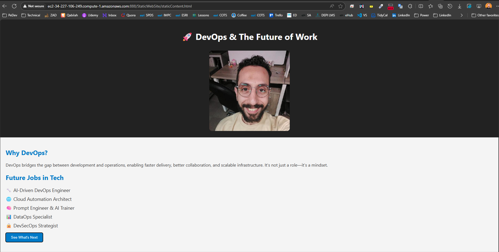
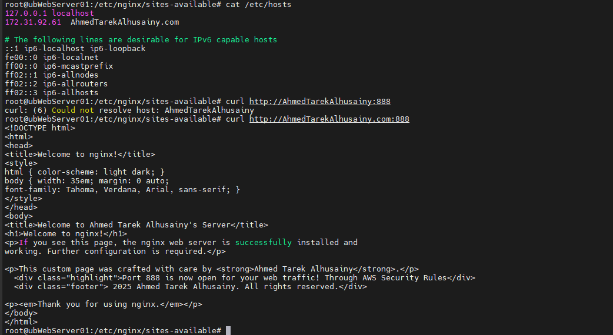

# 🧪 Lab 4: Serving Static Content and Assets

## 📝 Task

> Build and serve a basic website with static assets using Nginx by creating a project folder structure, adding HTML and JavaScript files, configuring Nginx for the new site, and enabling it for access.

**Subtasks:**

1. **Task 4.1** – Create Website Structure
2. **Task 4.2** – Create JavaScript File
3. **Task 4.3** – Create Main HTML Page
4. **Task 4.4** – Configure Nginx for the New Site
5. **Task 4.5** – Enable the Site

---

## ✅ Steps

1. Create a dedicated folder structure for the website, separating HTML, CSS, and JavaScript files.
2. Add a JavaScript file with basic functionality for the site.
3. Build the main HTML page and link it to the JavaScript file.
4. Create an Nginx server block to serve the new site from the created directory.
5. Enable the site and reload Nginx to make it accessible in the browser.

---
## 💻 Command(s)

```bash
cd /etc/nginx/sites-available
sudo touch staticContentAndAssets
sudo vim staticContentAndAssets

server {
        listen 888;
        server_name _;
        root /var/www/html/StaticWebSite;
        index staticContent.html;
}

mkdir -p /var/www/html/StaticWebSite
touch staticContent.html
touch staticContent.js
touch staticContent.css
mkdir assests
vim staticContent.html
vim staticContent.js
vim staticContent.css

# Create Symboloic Link 
sudo ln -sf /etc/nginx/sites-available/staticContentAndAssets /etc/nginx/sites-enabled/staticContentAndAssets

#Then 

sudo nginx -t
sudo systemctl reload nginx

```





---

## 🔎 Verification / Expected Output

* The site folder contains organized subdirectories for assets (e.g., `js`, `css`, `images`).
* The main HTML page loads correctly in the browser with JavaScript functionality working.
* Nginx configuration passes syntax checks and the new site is accessible via browser.

---

## 📦 Artifacts / Deliverables

* Screenshot of the site folder structure.
* Screenshot of the site loaded in a browser.
* Screenshot of successful Nginx syntax test for the new site configuration.

---

## 🧠 Reflection

* Learned how to structure static content for web serving.
* Understood how to configure and enable a dedicated Nginx server block for a site.
* Practiced organizing assets and linking them in HTML for browser delivery.

