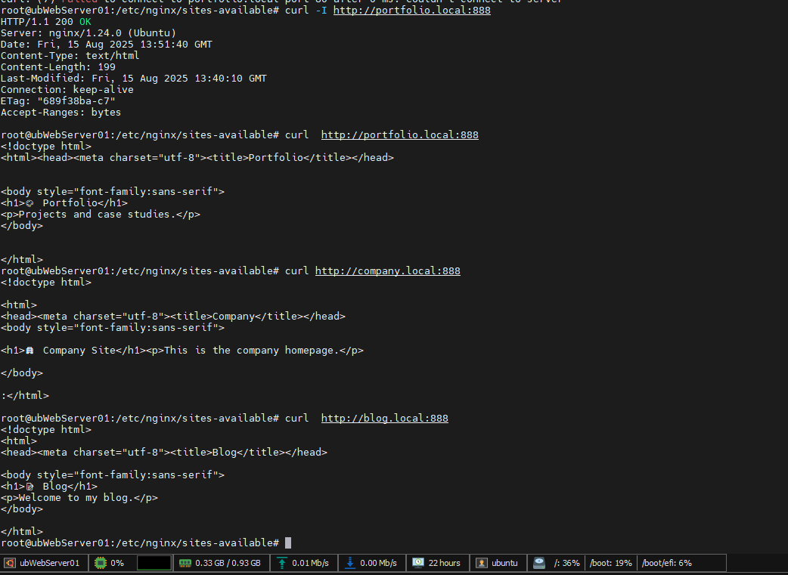
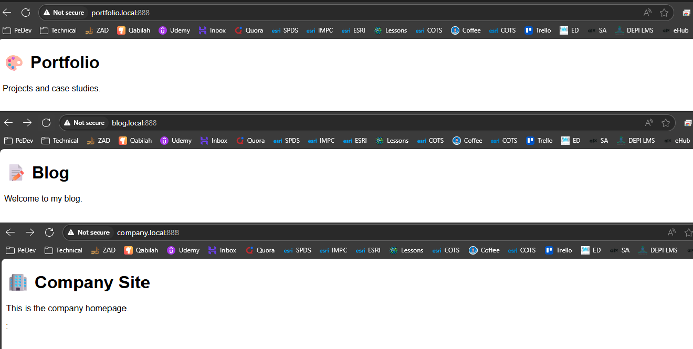

# 🧪 Lab 5: Creating Multiple Virtual Hosts

## 📝 Task

> Configure Nginx to serve three different websites (Company, Blog, Portfolio) using separate virtual host configurations, and test them locally by mapping domain names to the server.

**Subtasks:**

1. **Task 5.1** – Create Multiple Website Directories
2. **Task 5.2** – Create Content for Company Site
3. **Task 5.3** – Create Content for Blog Site
4. **Task 5.4** – Create Content for Portfolio Site
5. **Task 5.5** – Create Server Block Configurations
6. **Task 5.6** – Enable All Sites
7. **Task 5.7** – Add Domain Names to Hosts File
8. **Task 5.8** – Test All Virtual Hosts

---

## ✅ Steps

1. Create separate root directories for each site under `/var/www/`.
2. Add distinct HTML content for each site.
3. Configure three separate Nginx server blocks, each pointing to the correct root and responding to its domain name.
4. Enable all three site configurations in `sites-enabled/`.
5. Map test domain names (e.g., `company.local`, `blog.local`, `portfolio.local`) in the local `/etc/hosts` file.
6. Reload Nginx and access each site via its domain name in a browser to verify.

---
## 💻 Command(s)

```bash
# Create Company Site Directory
sudo mkdir -p /var/www/company
sudo mkdir -p /var/www/blog
sudo mkdir -p /var/www/portfolio
sudo nano /var/www/company/index.html

<!doctype html><html><head><meta charset="utf-8"><title>Company</title></head>
<body style="font-family:sans-serif">
<h1>🏢 Company Site</h1><p>This is the company homepage.</p>
</body></html>


sudo nano /var/www/blog/index.html
<!doctype html><html><head><meta charset="utf-8"><title>Blog</title></head>
<body style="font-family:sans-serif">
<h1>📝 Blog</h1><p>Welcome to my blog.</p>
</body></html>

sudo nano /var/www/portfolio/index.html
<!doctype html><html><head><meta charset="utf-8"><title>Portfolio</title></head>
<body style="font-family:sans-serif">
<h1>🎨 Portfolio</h1><p>Projects and case studies.</p>
</body></html>

# Config File For All Hosts
sudo vim /etc/nginx/sites-available/multiphosts
server {
    listen 888;
    server_name company.local;
    root /var/www/company;
    index index.html;

    location / {
        try_files $uri $uri/ =404;
    }
}


server {
    listen 888;
    server_name blog.local;
    root /var/www/blog;
    index index.html;

    location / {
        try_files $uri $uri/ =404;
    }
}

server {
    listen 888;
    server_name portfolio.local;
    root /var/www/portfolio;
    index index.html;

    location / {
        try_files $uri $uri/ =404;
    }
}

# Create Soft Link 
sudo ln -s /etc/nginx/sites-available/multiphosts   /etc/nginx/sites-enabled/multiphosts

#Check Config 
sudo nginx -t
sudo systemctl reload nginx

# Map Domains In Local Hosts On EC2

sudo nano /etc/hosts

127.0.0.1 localhost
172.31.92.61  AhmedTarekAlhusainy.com

#using public or private IP No worries 
34.227.106.249  company.local  
34.227.106.249  blog.local
34.227.106.249  portfolio.local


# Map Public IPs on My Machine so i can test inside vm and publically 
34.227.106.249  company.local  #Here Must Provide Public IP From AWS management console
34.227.106.249  blog.local
34.227.106.249  portfolio.local


# TEst From Terminal
curl -I http://company.local
curl -I http://blog.local
curl -I http://portfolio.local

```



# Test From Browser on My PC



---

## 🔎 Verification / Expected Output

* Each domain displays its own unique HTML content.
* Requests to `company.local` show the Company site content.
* Requests to `blog.local` show the Blog site content.
* Requests to `portfolio.local` show the Portfolio site content.
* Nginx syntax check passes with no errors.

---

## 📦 Artifacts / Deliverables

* Screenshot of `/var/www` showing all site directories.
* Screenshot of browser tabs showing each site loaded via its domain name.
* Screenshot of `nginx -t` showing configuration syntax is OK.

---

## 🧠 Reflection

* Learned how to configure multiple virtual hosts in Nginx.
* Practiced organizing website directories and managing multiple server block configurations.
* Understood the role of the `/etc/hosts` file in local DNS resolution.

---

