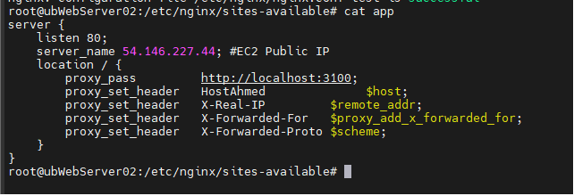
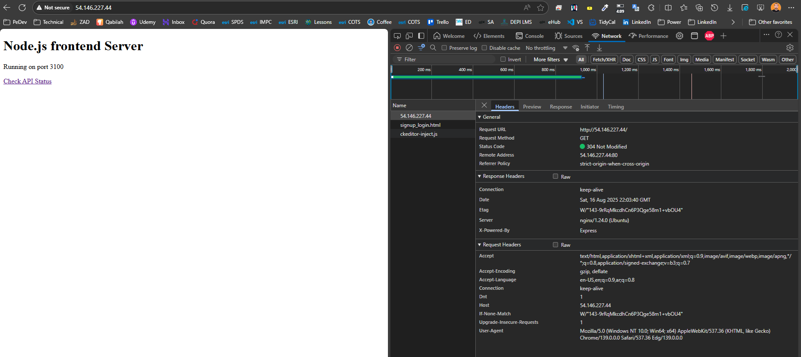
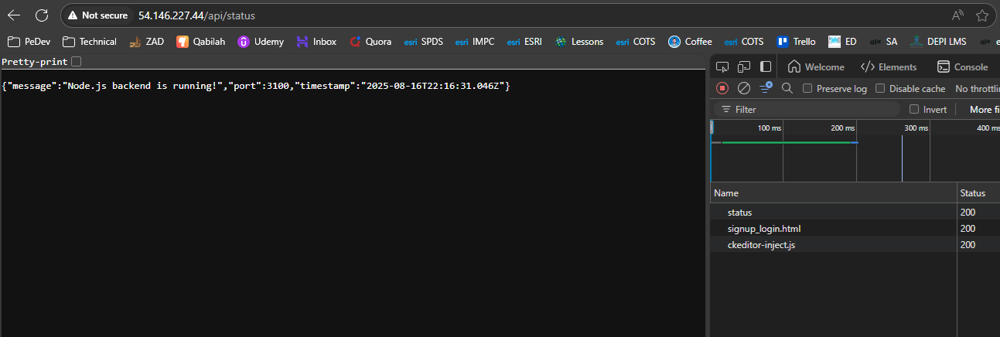

# 🧪 Lab 6: Setting Up Reverse Proxy

## 📝 Task

> Run a simple backend app, place Nginx in front as a reverse proxy, and verify basic and advanced proxy features (headers, timeouts, health checks).

**Subtasks:**

1. **Task 6.1** – Create a Simple Backend Server
2. **Task 6.2** – Start the Backend Server
3. **Task 6.3** – Configure Nginx Reverse Proxy
4. **Task 6.4** – Enable and Test the Proxy
5. **Task 6.5** – Advanced Proxy Configuration
6. **Task 6.6** – Test Advanced Features

---

## ✅ Steps

1. Create and run a minimal backend (Flask) on port **3000** with `/`, `/api`, and `/health`.
2. Create an Nginx server block that **proxies** `http://<public-ip>` to `http://127.0.0.1:3000`.
3. Verify the proxy works from your browser and with `curl`.
4. Add advanced options (forwarded headers, timeouts, buffering) and re-test.

---

## 💻 Command(s)

```bash
# ========== Task 6.1: Create a Simple Backend Server ==========

# Update package list
sudo apt update

# Install Node.js and npm
sudo apt install nodejs npm -y

# Verify installation
node --version
npm --version

# Create directory (no sudo needed for user directories)
mkdir node-app
cd node-app

# Initialize npm (no sudo needed)
npm init -y
npm install express

# Create app.js (no sudo needed for files in user directory)
sudo tee app.js << 'EOF'
const express = require('express');
const app = express();
const PORT = 3100;

// Serve static files
app.use(express.static('public'));

// API endpoint
app.get('/api/status', (req, res) => {
    res.json({
        message: 'Node.js backend is running!',
        port: PORT,
        timestamp: new Date().toISOString()
    });
});

// Main route
app.get('/', (req, res) => {
    res.send(`
        <!DOCTYPE html>
        <html>
        <head>
            <title>Node.js Server - Port ${PORT}</title>
        </head>
        <body>
            <h1>Node.js frontend Server</h1>
            <p>Running on port ${PORT}</p>
            <p><a href="/api/status">Check API Status</a></p>
        </body>
        </html>
    `);
});

app.listen(PORT, '0.0.0.0', () => {
    console.log(`Server running at http://0.0.0.0:${PORT}`);
});
EOF

# Create public directory and file (no sudo needed)
mkdir public
echo "<h2>Static file served by Node.js</h2>" | sudo tee public/test.html

```

```bash
# ========== Task 6.2: Start the Backend Server ==========

# Run the app
node app.js

```

```bash
# ========== Task 6.3: Configure Nginx Reverse Proxy ==========
# New Nginx site
sudo vim /etc/nginx/sites-available/app
```

```nginx
server {
    listen 80;
    server_name 54.146.227.44; #EC2 Public IP
    location / {
        proxy_pass         http://localhost:3100;
        proxy_set_header   Host              $host;
        proxy_set_header   X-Real-IP         $remote_addr;
        proxy_set_header   X-Forwarded-For   $proxy_add_x_forwarded_for;
        proxy_set_header   X-Forwarded-Proto $scheme;
    }
}
```

Enable and reload:

```bash
sudo ln -s /etc/nginx/sites-available/app /etc/nginx/sites-enabled/
sudo nginx -t
sudo systemctl reload nginx
```


# ========== Task 6.4: Enable and Test the Proxy ==========




# Watch logs while you test:
```bash
sudo tail -f /var/log/nginx/access.log /var/log/nginx/error.log
```

```bash
# ========== Task 6.5: Advanced Proxy Configuration ==========
# Edit the same file and replace the server block with this richer version:
sudo vim /etc/nginx/sites-available/app 
```

Paste:

```nginx
server {
    listen 80;
    server_name 54.146.227.44;

    location / {
        proxy_pass http://localhost:3100;
        proxy_http_version 1.1;
        proxy_set_header Host $host;
        proxy_set_header X-Real-IP $remote_addr;
        proxy_set_header X-Forwarded-For $proxy_add_x_forwarded_for;
        proxy_set_header X-Forwarded-Proto $scheme;
        proxy_set_header Connection "";

        # Timeouts
        proxy_connect_timeout 5s;
        proxy_send_timeout    30s;
        proxy_read_timeout    30s;

        # Buffers
        proxy_buffering on;
        proxy_buffers 8 16k;
        proxy_buffer_size 16k;
    }

    # Health check
    location /health {
        proxy_pass http://localhost:3100/health;
        proxy_set_header Host $host;
    }

    # Optional static hosting from nginx
    # location /static/ {
    #     alias /var/www/static/;
    #     expires 7d;
    #     access_log off;
    # }
}

```

Apply the changes:

```bash
sudo nginx -t
sudo systemctl reload nginx
```
