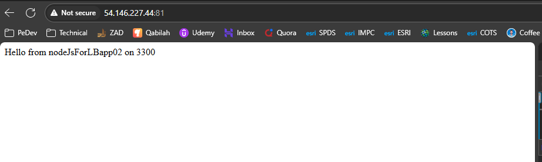
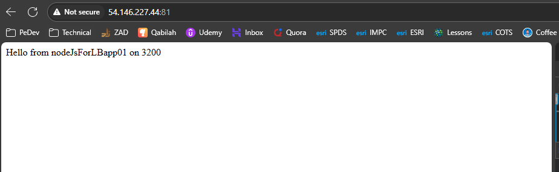
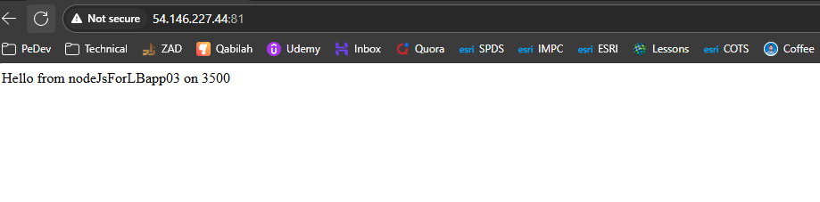

# 🧪 Lab 7: Load Balancing Setup

## 📝 Task

> Configure Nginx to distribute traffic across multiple backend servers using different load balancing methods (round robin, weighted, least connections), and test failover scenarios.

**Subtasks:**

1. **Task 7.1** – Create Multiple Backend Servers
2. **Task 7.2** – Start All Backend Servers
3. **Task 7.3** – Configure Round Robin Load Balancing
4. **Task 7.4** – Test Round Robin Load Balancing
5. **Task 7.5** – Configure Weighted Load Balancing
6. **Task 7.6** – Configure Least Connections Load Balancing
7. **Task 7.7** – Test All Load Balancing Methods
8. **Task 7.8** – Test Failover

---

## ✅ Steps

1. Create at least two simple backend servers (e.g., Node.js apps on different ports).
2. Start each backend server and verify they respond individually.
3. Configure an Nginx `upstream` block and set it to round robin (default).
4. Test by refreshing the page multiple times to see alternating responses.
5. Update the configuration to include **weights** and test traffic distribution.
6. Change strategy to **least connections** and confirm behavior.
7. Compare all methods (round robin, weighted, least connections).
8. Stop one backend server and verify traffic is redirected to remaining servers (failover).

---

## 💻 Command(s)
Before Doing I was inquiring can I implment LB on one EC2 or should I create two EC2s and then configure LB on them. 

**we Can Do Both** :
1- Single EC2 (all-in-one): run Nginx + multiple backend apps on the same machine (each app on a different port). Nginx load-balances across localhost:PORTs.
2- Multiple EC2s: run Nginx (LB) on one instance and backends on other instances (each with a private IP). This is closer to production.

```bash
mkdir nodeJsForLBapp01 nodeJsForLBapp02
cd nodeJsForLBapp01

# nodeJsForLBapp01
npm init -y
npm install express

cat > nodeJsForLBapp01.js <<'EOF'
const express = require('express'); const app = express(); const PORT = 3200;
app.get('/', (_,res)=>res.send('Hello from nodeJsForLBapp01 on 3200'));
app.listen(PORT,'127.0.0.1',()=>console.log(`nodeJsForLBapp01 on ${PORT}`));
EOF
node nodeJsForLBapp01.js


cd ../nodeJsForLBapp02

# nodeJsForLBapp02
npm init -y
npm install express

cat > nodeJsForLBapp02.js <<'EOF'
const express = require('express'); const app = express(); const PORT = 3300;
app.get('/', (_,res)=>res.send('Hello from nodeJsForLBapp02 on 3300'));
app.listen(PORT,'127.0.0.1',()=>console.log(`nodeJsForLBapp02 on ${PORT}`));
EOF
node nodeJsForLBapp02.js

# nodeJsForLBapp03 Backup
mkdir nodeJsForLBapp03
cd nodeJsForLBapp03
npm init -y
npm install express

cat > nodeJsForLBapp03.js <<'EOF'
const express = require('express'); const app = express(); const PORT = 3500;
app.get('/', (_,res)=>res.send('Hello from nodeJsForLBapp03 on 3500'));
app.listen(PORT,'127.0.0.1',()=>console.log(`nodeJsForLBapp03 on ${PORT}`));
EOF
node nodeJsForLBapp03.js


# Testing

curl http://127.0.0.1:3200/
curl http://127.0.0.1:3300/
curl http://127.0.0.1:3500/


# Config LB Configuration
sudo vim /etc/nginx/site-available/nodeJsLB

upstream nodeJsLbPool {
        #round robin is enabled by default
server localhost:3200;
server localhost:3300;
server localhost:3500 backup;
}


server {
                listen 81;
                server_name 54.146.227.44 c2-54-146-227-44.compute-1.amazonaws.com;

                location / {

                                proxy_pass http://nodeJsLbPool;
								proxy_set_header Host               $host;
        						proxy_set_header X-Real-IP          $remote_addr;
        						proxy_set_header X-Forwarded-For    $proxy_add_x_forwarded_for;
        						proxy_set_header X-Forwarded-Proto  $scheme;
                }

}


sudo ln -s /etc/nginx/sites-available/nodeJsLB /etc/nginx/sites-enabled/

sudo nginx -t
sudo systemctl restart nginx


# You Must Allow Secuirty Rules Over Port 81 --> 0.0.0.0/0
# And Locally 
sudo ufw allow 81/tcp
# Test
curl http://127.0.0.1:81/

```




### Configuring Weighted & Least -Connections

```bash 
upstream nodeJsLbPool {
    least_conn;                 # enable least connections
    server 127.0.0.1:3300 weight=3;  # weighted example (more traffic to app1)
    server 127.0.0.1:3200 weight=1;
    server 127.0.0.1:3500 backup;
}


```
### Failover test

1- Stop one backend (e.g., Ctrl+C in the app1 terminal). 
2- Refresh the browser—traffic should still come from the remaining app.


---

## 🔎 Verification / Expected Output

* Each backend server responds on its port individually.
* Round robin alternates responses between servers.
* Weighted load balancing favors higher-weight servers.
* Least connections prioritizes less busy servers.
* During failover, requests are still served without downtime.

---

## 📦 Artifacts / Deliverables

* Screenshots/logs of responses from multiple servers.
* Nginx configuration snippets for each load balancing method.

---

## 🧠 Reflection

* Understood how Nginx can act as a load balancer.
* Learned differences between round robin, weighted, and least connections.
* Observed how Nginx handles server failures gracefully.

