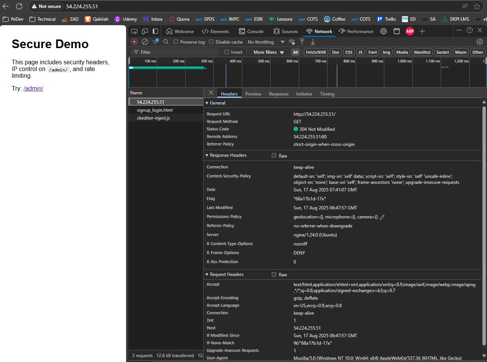
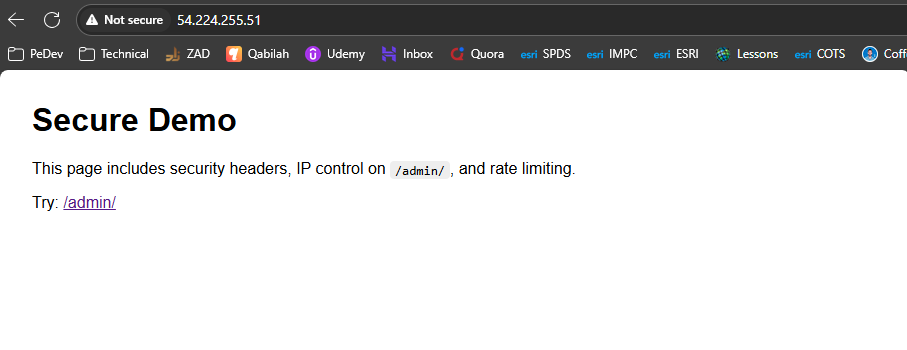
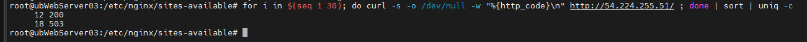

# 🧪 Lab 8: Implementing Basic Security

## 📝 Task

> Add common security headers, enable rate limiting (in main Nginx config), restrict access to a protected path by IP, and create a simple monitoring script to watch for 403/429 events.

**Subtasks:**

1. **Task 8.1** – Configure Security Headers
2. **Task 8.2** – Configure Rate Limiting in Main Config
3. **Task 8.3** – Create Secure Website Content
4. **Task 8.4** – Enable and Test Security Configuration
5. **Task 8.5** – Test Security Headers
6. **Task 8.6** – Test IP Access Control
7. **Task 8.7** – Test Rate Limiting
8. **Task 8.8** – Create Security Monitoring Script

---

## ✅ Steps

1. Back up configs and create a **security headers** snippet.
2. Add **limit\_req\_zone / limit\_conn\_zone** in **/etc/nginx/nginx.conf** (http block).
3. Create a **secure site** with a protected `/admin/` path.
4. Enable the site, disable default (optional), validate, reload.
5. Verify headers via `curl -I`.
6. Lock `/admin/` to your **public IP** (and localhost) and test 403/200.
7. Hammer the site to trigger **429** from rate limiting.
8. Create a simple **monitoring script** to list top IPs hitting 403/429.

---

## 💻 Command(s)

```bash
# ---------- PREP ----------
# Make sure Nginx is installed
sudo apt update
sudo apt install -y nginx

# Open HTTP in AWS SG (console) and, if using UFW locally:
sudo ufw allow 'Nginx HTTP' 2>/dev/null || true

# ---------- Task 8.1: Security Headers Snippet ----------
# Create a reusable headers snippet
sudo mkdir -p /etc/nginx/snippets #already created by default 

# Create the snippet file with headers

sudo tee /etc/nginx/snippets/security-headers.conf >/dev/null <<'EOF'
# Basic security headers (safe defaults for labs)
add_header X-Content-Type-Options "nosniff" always;
add_header X-Frame-Options "DENY" always;
add_header Referrer-Policy "no-referrer-when-downgrade" always;
add_header X-XSS-Protection "0" always;
# Simple CSP that still lets our demo page load inline styles
add_header Content-Security-Policy "default-src 'self'; img-src 'self' data:; script-src 'self'; style-src 'self' 'unsafe-inline'; object-src 'none'; base-uri 'self'; frame-ancestors 'none'; upgrade-insecure-requests" always;
# Lock down powerful browser features by default
add_header Permissions-Policy "geolocation=(), microphone=(), camera=()" always;

# NOTE: Only enable HSTS when you serve HTTPS, not HTTP.
# add_header Strict-Transport-Security "max-age=31536000; includeSubDomains; preload" always;
EOF

# ---------- Task 8.2: Rate Limiting in Main Config ----------
# Backup nginx.conf
sudo cp /etc/nginx/nginx.conf /etc/nginx/nginx.conf.bak

# Edit nginx.conf and add rate-limiting zones inside the `http { ... }` block.
# We'll open the file ; paste the 3 lines below right after "http {"
sudo nano /etc/nginx/nginx.conf
# Paste INSIDE the http { } block:
limit_req_zone  $binary_remote_addr zone=req_per_ip:10m rate=5r/s;
limit_conn_zone $binary_remote_addr zone=conn_per_ip:10m;
log_format sec '$remote_addr - $status "$request" -> $upstream_addr ($http_user_agent)';

# ---------- Task 8.3: Secure Website Content ----------
# Create a simple site
sudo mkdir -p /var/www/secure
sudo tee /var/www/secure/index.html >/dev/null <<'EOF'
<!doctype html><html><head><meta charset="utf-8"><title>Secure Site</title>
<style>body{font-family:sans-serif;margin:2rem}code{background:#eee;padding:.1rem .3rem;border-radius:4px}</style>
</head><body>
<h1>Secure Demo</h1>
<p>This page includes security headers, IP control on <code>/admin/</code>, and rate limiting.</p>
<p>Try: <a href="/admin/">/admin/</a></p>
</body></html>
EOF

# Create an admin page (we'll IP-restrict access)
sudo mkdir -p /var/www/secure/admin
sudo tee /var/www/secure/admin/index.html >/dev/null <<'EOF'
<!doctype html><html><head><meta charset="utf-8"><title>Admin</title></head>
<body style="font-family:sans-serif;margin:2rem">
<h1>Admin Area</h1>
<p>If you can see this from your laptop, your IP is allowed. Otherwise, you should get 403.</p>
</body></html>
EOF

# ---------- Task 8.4: Site Config + Enable ----------
# Get your laptop's public IP (run this ON YOUR LAPTOP, not on EC2), then copy it:
#   curl -s ifconfig.me
# Put that value below as <YOUR_PUBLIC_IP>

sudo tee /etc/nginx/sites-available/secure >/dev/null <<'EOF'
server {
    listen 80;
    server_name 54.224.255.51;

    root /var/www/secure;
    index index.html;

    # Include the security headers for ALL responses from this server
    include snippets/security-headers.conf;

    # Default location + rate & connection limits
    location / {
        try_files $uri $uri/ =404;
        # Use zones defined in nginx.conf (Task 8.2)
        limit_req  zone=req_per_ip  burst=10  nodelay;
        limit_conn conn_per_ip      20;
    }
# Note Location -->
# ⚙️ What’s Happening Now
# Your current config sets the root to /var/www/secure, so visiting / serves /var/www/secure/index.html.
# 
# /admin/ is correctly configured with an alias and IP control.
# 
# But /secure is not defined, so Nginx tries to find a file or folder named secure inside /var/www/secure, which likely doesn’t exist—resulting in a 404.
# 
#you can chnage it to default 
# server {
#     listen 80;
#     server_name 54.224.255.51;
# 
#     root /var/www/html;  # Serve default page from here
#     index index.html;
# 
#     include /etc/nginx/snippets/security-headers.conf;
# 
#     location / {
#         try_files $uri $uri/ =404;
#         limit_req zone=req_per_ip burst=10 nodelay;
#         limit_conn conn_per_ip 20;
#     }
# 
#     location /secure/ {
#         alias /var/www/secure/;
#         index index.html;
#     }
# 
#     location /admin/ {
#         alias /var/www/secure/admin/;
#         autoindex off;
# 
#         allow 41.234.212.161;
#         allow 127.0.0.1;
#         deny all;
# 
#         limit_req zone=req_per_ip burst=5 nodelay;
#         limit_conn conn_per_ip 10;
#     }
# }


    # IP access control for /admin/ (ALLOW your IP + localhost, DENY the rest)
    location /admin/ {
        alias /var/www/secure/admin/;  # serve files from this dir
        autoindex off;

        # Replace <YOUR_PUBLIC_IP> with your laptop's public IP (e.g., 203.0.113.10)
		# Using Site : https://whatismyipaddress.com/
        allow 41.234.212.161;
        allow 127.0.0.1;
        deny  all;

        # Keep the same limits here (optional)
        limit_req  zone=req_per_ip  burst=5 nodelay;
        limit_conn conn_per_ip      10;
    }
}
EOF

# Enable the site 
sudo ln -sf /etc/nginx/sites-available/secure /etc/nginx/sites-enabled/secure


# Validate and reload
sudo nginx -t
sudo systemctl reload nginx
```

---

## 🔎 Verification / Expected Output

### Task 8.5 — Test Security Headers

```bash
# From your laptop (or SSH session), replace <EC2_PUBLIC_IP>
curl -I http://54.224.255.51/
```

You should see headers like:

```
X-Content-Type-Options: nosniff
X-Frame-Options: DENY
Content-Security-Policy: default-src 'self'; ...
Permissions-Policy: geolocation=(); ...
```

### Task 8.6 — Test IP Access Control

```bash
# From the EC2 instance (allowed via 127.0.0.1):
curl -I http://127.0.0.1/admin/
# Expect: HTTP/1.1 200 OK

# From your laptop browser (if you put YOUR public IP in allow):
http://54.224.255.51/admin/            # Expect: page loads (200)

# From any other network (not allowed):
curl -I http://54.224.255.51/admin/    # Expect: HTTP/1.1 403 Forbidden
```





### Task 8.7 — Test Rate Limiting

```bash
# Send 30 quick requests; some should be 429 if you exceed 5 r/s with burst 10
for i in $(seq 1 30); do curl -s -o /dev/null -w "%{http_code}\n" http://54.224.255.51/ ; done | sort | uniq -c
# Expect counts showing some 200 and some 429
```



Watch logs while hammering:

```bash
sudo tail -f /var/log/nginx/access.log /var/log/nginx/error.log
```

---

## 📦 Artifacts / Deliverables

* Screenshot of `curl -I http://<EC2_PUBLIC_IP>/` showing security headers.
* Screenshot of `/admin/` from allowed IP (200) and a 403 from a disallowed IP.
* Output of the rate-limit test showing 429 responses.
* Output of `sudo nginx -t` showing syntax OK.

---

## 🧠 Reflection

* You added practical security headers and saw them in responses.
* You enforced IP-based access control to a sensitive path.
* You limited request/connection rates to reduce abuse.
* You built a small monitoring script to spot offenders quickly.

---

## 🔁 Bonus: Task 8.8 — Security Monitoring Script

```bash
# Create a simple watcher for 403/429 in the last 5 minutes
sudo tee /usr/local/bin/nginx-security-watch.sh >/dev/null <<'EOF'
#!/usr/bin/env bash
LOG="/var/log/nginx/access.log"
echo "== Top IPs causing 403/429 in the last 5 minutes =="
# Adjust the time window by changing "5 minutes ago"
since=$(date -d '5 minutes ago' '+%d/%b/%Y:%H:%M')
awk -v since="$since" '
  $4 >= "["since && ($9==403 || $9==429) { cnt[$1]++ }
  END { for (ip in cnt) printf "%5d  %s\n", cnt[ip], ip | "sort -nr" }
' "$LOG"
echo
echo "== Recent 403/429 lines =="
grep -E ' 403 | 429 ' "$LOG" | tail -n 20 || true
EOF

sudo chmod +x /usr/local/bin/nginx-security-watch.sh

# Run it
sudo /usr/local/bin/nginx-security-watch.sh
```

> This prints top offending IPs and the most recent 403/429 lines. You can cron it later if you like.

