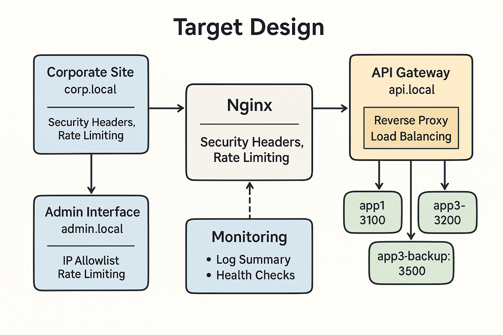

# Architecture Overview

This project simulates a small production Nginx environment.

## Components
1. **Corporate Website**
   - Static content served directly by Nginx
   - Accessible via `http://corp.local`

2. **Admin Interface**
   - Static pages or PHP/Node admin portal
   - Accessible via `http://admin.local`

3. **API Gateway**
   - Nginx reverse proxy to backend Node.js apps
   - Load balancing with round robin
   - Backup server in case primaries fail
   - Accessible via `http://api.local`

4. **Backend Apps**
   - Node.js Express apps running on different ports
   - Example: `3200`, `3300`, `3500`

5. **Monitoring Dashboard**
   - Nginx status module or log scripts
   - Accessible via `http://status.local` (optional)

---

## Data Flow
1. User opens browser and types domain (e.g., `api.local`)
2. Nginx receives request on port 80 (or 443 if SSL)
3. If static → served directly from `/var/www/`
4. If API → request forwarded to backend pool
5. Response is sent back to user

---

## Diagram

